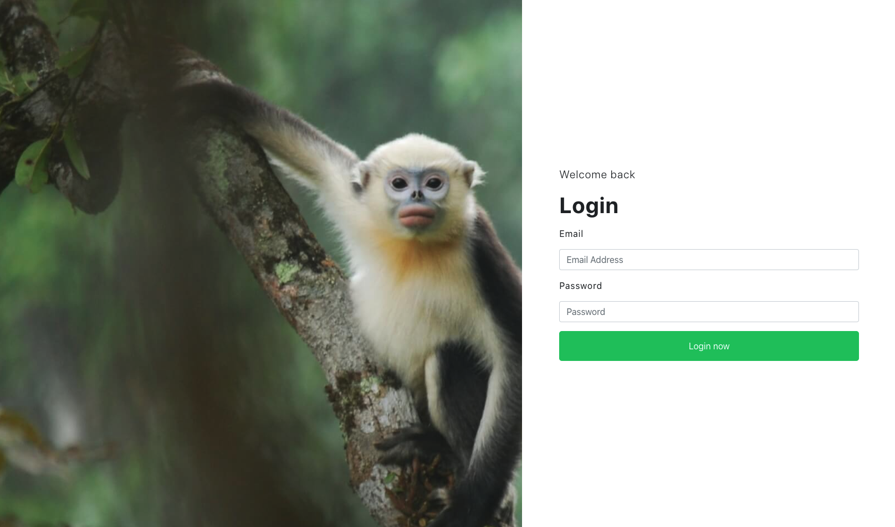
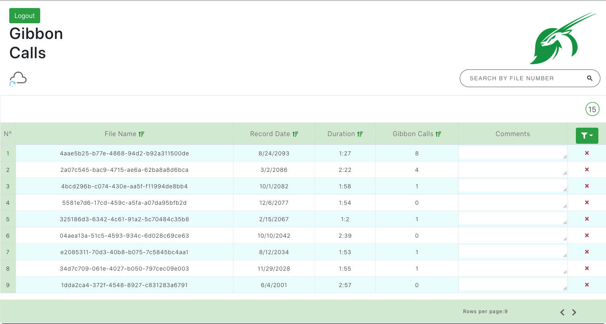
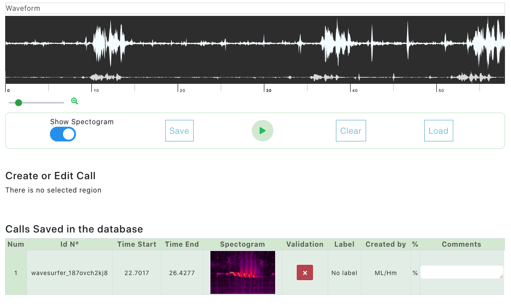
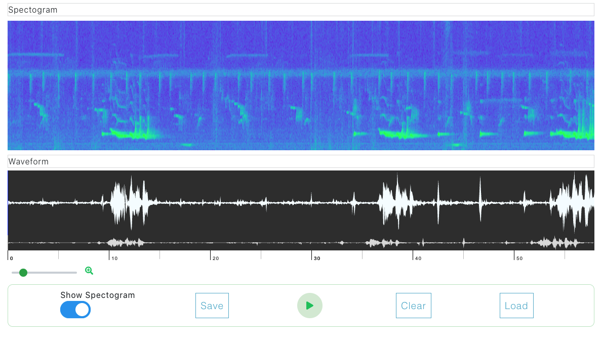
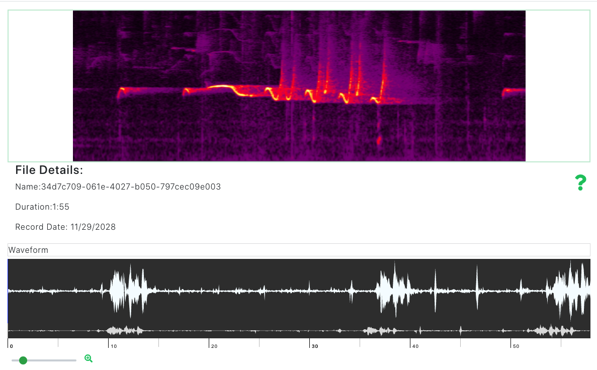

# Gibbon Calls Project

## Collaboration from Coderschool and FFI

<h1 align="center"><GibbonCallsProject></h1>

## Links

- [Repo](https://github.com/Juank060790/GibbonCallsProject "<GibbonCallsProject> Repo")

### Why

 The critically endangered Tonkin snub-nosed monkey has been at the centre of FFI’s primate conservation activities for well over a decade. In 2002 and 2007, FFI surveys led to the discovery of two key populations of the species in Khau Ca forest, Ha Giang Province and later in Tung Vai watershed protection forest in Quan Ba district, Ha Giang province on the border with China. 

 Since 2002, FFI has been focusing on community-led conservation by engaging local communities in species monitoring and habitat protection. Established in 2009, the Khau Ca Species and Habitat Conservation Area engages with the Management Advisory Committee and Community Conservation Teams to determine its management structure. It is the first successful model of special use forest management and has demonstrated the role of communities in species conservation and decision making of a special use forest. FFI has also developed a species conservation action plan for these sites, and continues to raise awareness about this endemic primate.

In 2015, FFI built the Tung Vai conservation field station and today continues to support community-based patrol groups in Quan Ba. In April 2017, another conservation field station was built in Rao Dan Chai forest, also in Quan Ba. An assessment of the agriculture in Quan Ba identified the impact of cash and subsistence crop growth on forest quality. Cardamom was identified as the primary cash crop and FFI is currently planning mitigation strategies to protect forest quality for the Tonkin snub-nosed monkey. 

Whilst the species is still listed as one of the 25 Most Endangered Primates in the World by the IUCN Primate Specialist Group, through FFI’s work the population in Ha Giang has increased by at least 75% to around 150 individuals.

## Project details

The project is made to helped researchers to organize, label, count and save time in the procces of labeling data and count the calls of Tonkin snub-nose monkey. The project has 2 parts:

- Process data through ML, creating predictions where the call was made.

- Web Platform:
  - Created a User Interface (UI) to access audio recording files and view model predictions.
  - Added some simple interactions with the audio files and extracted call files.

### UI details

The UI is built around the Recording List page, which is only accessible once the user has login. 

Ex. Login Page

Ex. Recording List Page (Data shown is test data only)

 The Recording List Page displays a table containing information about all raw audio recordings. Displayed information for each recording includes: File Name (id), Record Date, Duration, No. of Gibbon Calls in the recording, Action (Tick and Cross buttons for users to mark whether the prediction in the recording is correct or not), Comments (for users to write notes) and Delete button to delete the recording from the table (the recording will NOT be deleted from the database).

The table can be filtered by Record Date, Duration, and No. of Gibbon Calls (Green Filter button on the right of the Table Header). There is also a search box to search for a file name and a slider to change the number of recordings displayed on the page.

Clicking on a recording on the table will display a model showing detailed information about the gibbons calls detected by the Machine Learning model. The calls are displayed in a table, containing information about their id, Time Start, Time End, mel-scale Spectrogram image, Action (Tick and Cross buttons for users to mark whether the prediction of the call is correct or not), Tags (Label of the call) and Comments (for users to write notes). The recording can also be played by clicking on the Play button in the center of the Modal.

Ex. Modal Displaying Calls within a Recording

Clicking on a call will display the image of the spectrogram oh the large area on top. In the upcoming phase, we plan to add more features to this area:

- Predicted calls will be highlighted on the spectrogram of the recording.
- User can interact with the spectrogram: adding, fixing and deleting the selection.

Ex. Spectrogram of a Call Displayed on the Top Section of the Modal

## Built With

- JavaScript
- ReactJS
- GCP
- Firestore
- NPM
- Webpack
- HTML
- CSS
- Bootstrap

## Future Updates

- []

## Author

**JuanCarlosDuran**
**Nguyễn Minh Anh**

- [Profile](https://github.com/Juank060790 "Juan Carlos")
- [Email](mailto:juank060790@gmail.com?subject=Hi "Hi!")
